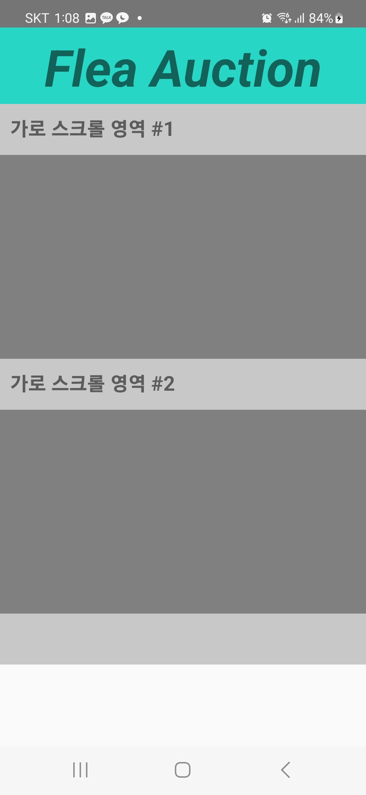
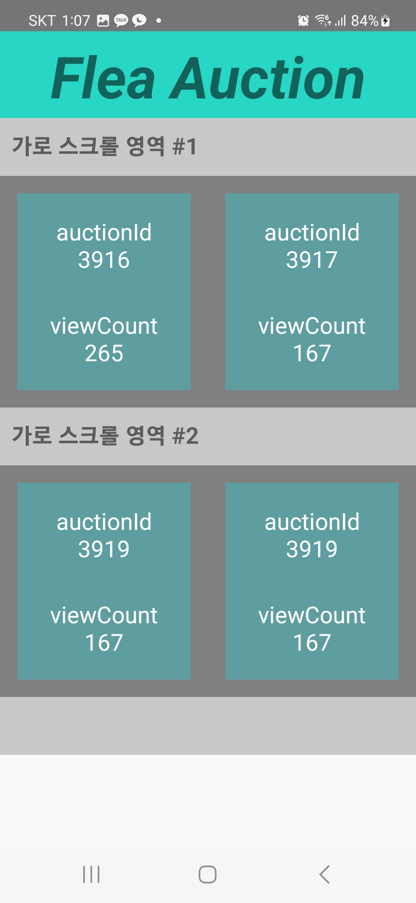
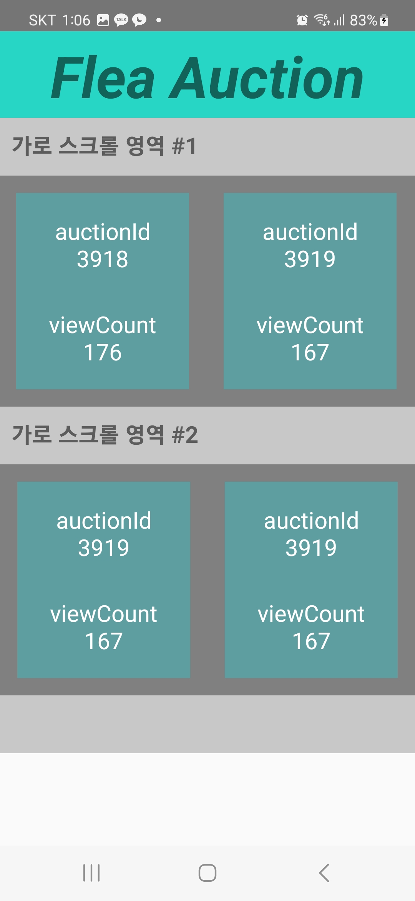
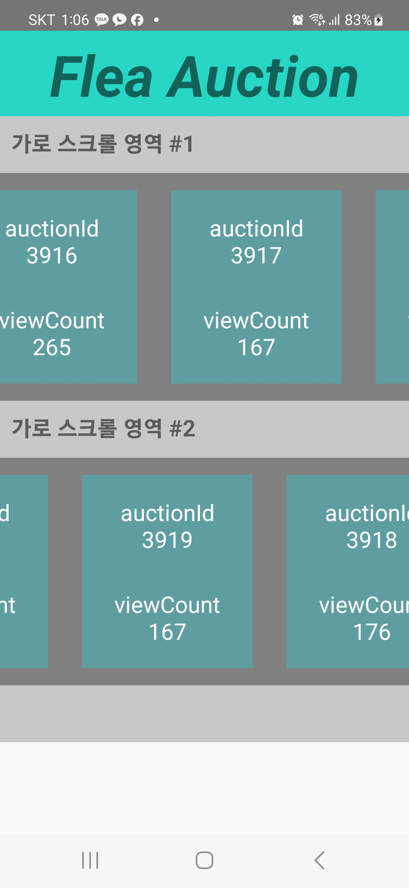
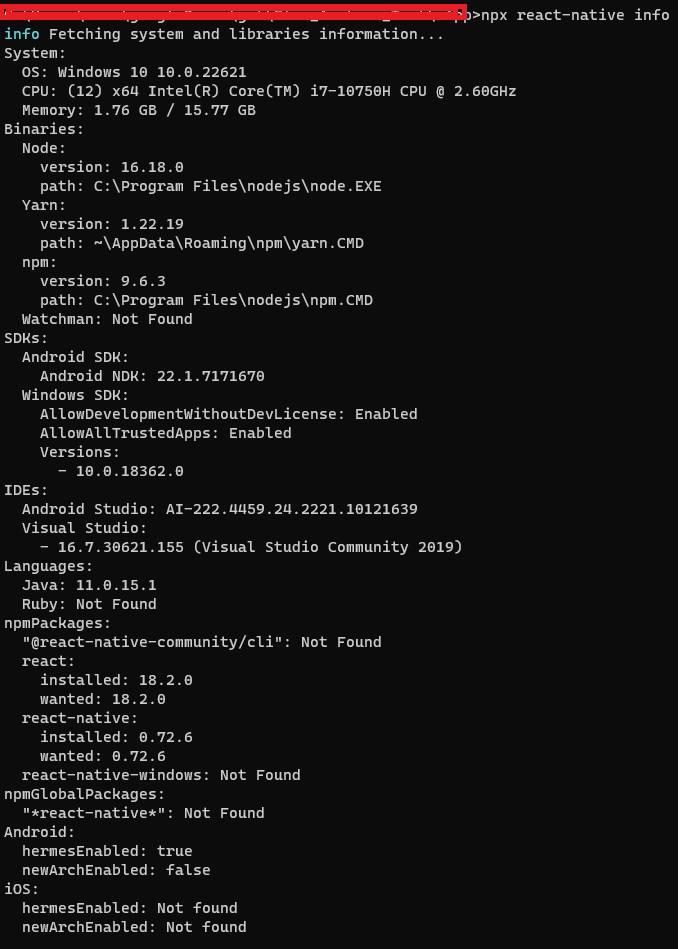

# Flea_Auction_Test
 - 이 프로젝트는 입사 전 플리옥션 사에서 코딩 테스트를 통해 개발자의 대한 자질이 있는지 실시
 - 프로젝트 특징 : React Native를 활용 할 수 있는 능력과, SSE Event를 활용하여 백엔드 API 연동
 - 실제 서비스는 방문 리스트 출력하는 메뉴를 확인 할 수 있으며 실행 전 연동을 할 수 있는지 본다.
 - URL 주소가 주어질 경우, API 형식으로 연동하는 것이 아닌 단방향 통신으로 Server와 연결 후 RN단에서는 데이터를 실시간으로 받아와야 한다.(SSE)
 - 재 연결 시 데이터 값이 완전 초기화가 되기 때문에 재호출은 금지 (React Query는 API 연동 용도에 적합)
 - 마지막으로 고객이 필요한 개발을 해주는 것으로 목표로 둔다.

 <br/><br/>

## Client Name (고객사 명)
- 발주업체 : (주) 플리옥션 (Flea Auction. Inc)
- 업종 : 미술 작품 컬렉션 판매 및 중계업
- Homepage : https://fleaauction.co/

 <br/><br/>

## Object
- 현재 웹 개발에 특화된 개발자로써 앱 개발까지 숙련도를 올릴 수 있는 프로젝트 중 하나
- 아주 기초적이지만, React Native와 Back-End 통신을 하기 위해 숙련도를 올린다.
- Android WebView 및 Native와 함께 사용하는 Hybrid App 외적으로 React Native 스택을 쌓는다.
- 마지막으로, 개발 숙련도를 올리면서 고객의 요구사항에 알맞게 수행하여 고객에게 환영받는 개발자로 목표로 한다.
- SSE와 pull-to-refresh의 대한 기능의 대해 학습을 진행한다.

<br/><br/>

## User Requirements Specifacation
- 고객사께서 작품 구매를 위한 히스토리 페이지를 개발을 하기 위해 진행을 한다.
- SSE 기법으로 이용하여 옥션으로 판매 하는 형식으로 실시간 UI 갱신을 원한다.
- 전 단계인 React Native와 Server와 통신하여 해당 로그를 읽고, 로그의 토대로 데이터 삽입
- 이와 동시에 SSE 기법과 React Native의 이해도와 활용하는 방법을 학습을 요망
- SSE 연동 후, 조회 수 갱신 및 Pull-To-Refresh의 대한 기능 활용 요구
- React의 대한 실력을 통해 프로젝트 파트너로 함께 갈 수 있는지의 대해 체크

<br/><br/>


## DeadLine
- <div style="font-size:1.5em;">
    23년 10월 <s style="font-color:gray; font-size:50%">20일(금)</s> 23(월)
    <span style="font-color:red; font-size:80%">(보다 더 깔끔한 개발을 위해 마감 날짜 연장)</span>
  </div>

<br/><br/>

## Preview (미리 보기)
- 아래 사진은 화면의 대한 결과물 및 기능들을 추가한 내용물 입니다.
- pull-to-refresh는 개발을 완성 하였으나, 스샷을 첨부하는데 어려워서 코드의 따른 기능을 확인하면 될 것 같습니다.

<div>
 
 
 
 
</div>

<br/><br/>

## Environment
- OS : Windows 11
- Node Version : 16.18.0 (가급적 동일한 버전 사용 추천 - 다른 버전일 경우 설정에 맞춰야 한다.)
- App : React Native
- Gradle : 7.5.1
- Library : react, asyncStorage, react-native-sse




<br/><br/>

## Gettings Start
<h3>사전 준비</h3>
- 사전 준비는 Google을 검색하여 설치하는 방법의 대해 검색 후 실행한다.
<div>
  <h4>공통</h4>
  <ul>
    <li>node js 설치 (필자는 16.18.0 사용)</li>
  </ul>
  <h4>Android OS 셋팅</h4>
  <ul>
    <li>Java 11 설치</li>
    <li>Gradle 설치</li>
    <li>Android Studio 설치 이후, SDK 설치</li>
  </ul>
  <h4>IOS 환경 셋팅(MAC OS 보유 필수)</h4>
  <ul>
    <li>Xcode 설치</li>
    <li>Watchman 설치</li>
    <li>Cocoapods 설치</li>
  </ul>
</div>

<h3>React Native 빌드 후 실행 방법 (Local - Debugger 모드)</h3>
- 현재 저는 MAC OS 장비가 없어서 xcode 설치할 수 있는 환경이 아니라 IOS의 대한 테스트를 진행하지 못하였습니다. IOS의 대한 내용은 학습한 기반으로만 올렸으며 IOS 테스트 할 때에는 고려하지 못한 점 이에 양해 바랍니다.<br/>
(1) 먼저 clone을 받는다.

```
$ git clone https://github.com/BerkleyLim/Flea_Auction_Test
```
<br/>
(2) 다음으로 npm으로 node_module 설치

```
$ cd ./Flea_Auction_Test/mApp
$ npm install
```

(3) 이후 npm run start(개발모드 - 배포모드x)<br/>
- 다음은 a 누르면 android 모드, i 누르면 ios 모드로 실행된다.

```
$ npm run start;

<안드로이드 : a>
<아이폰 : i>

```

(4) 이때 gradle이 kotlin build 실패가 나온디면 무시하고 다시 (3)번 과정을 걸칩니다.
```
> Task :react-native-screens:compileDebugKotlin
여기서 build 실패하여 시스템이 종료 될 수 있다.
이때, 무시하고 다시 한번 (3)과정으로 돌아가서

$ npm run start 실시하면 동작이 되어진다.
```

(5) 아이폰 환경에서 빌드 후 실행 시킬 경우 아래와 같이 실시 (만약 아이폰 빌드가 안될경우 해당, 필자는 mac os가 없어서 정확한 테스트를 진행 못하고, 알고 있는 내용만 공유함)
```
$ cd ios
$ pod repo update
$ pod install
```

<br/><br/>

## History
- history 폴더의 README.md를 참조하세요. [링크](https://github.com/BerkleyLim/Flea_Auction_Test/tree/main/history)

<br/><br/>

## QnA
<h3>1. React Native 로 앱개발 경험이 있다면, 상태관리는 어떤 것들을 사용해 보았으며, 가장 선호하는 방법은 무엇인지, 그리고 그 이유는 무엇입니까?</h3>

> - 저는 Profile Repository를 통해 Android뿐만 아닌 IOS도 호환되도록 Android WebView 기반 이외 Native 도입을 위해 시도를 해본적 있으나, 제대로 시작하지 못하였습니다.
> - 당시, Typescript와 React Native를 한번도 다뤄보지 않아 보류상태로 남겨 두었지만, Typescript와 친해지고 React 숙련도를 더 올린 이후 React Native를 시작하기로 마음 먹은 상태였습니다.
> - 이번 플리옥션 고객사 프로젝트를 통해 React Native를 첫 프로젝트로 시작하게 되었으며 SSE 역시 처음으로 개발을 하여 React Query로 개발을 하고자 하였으나 서버 캐쉬를 이용하여 사용이 가능하며, 실시간 비동기 방식으로 API를 호출하는 방식으로 사용하는 것에 어울려 SSE 환경에서는 적합하지 못한 환경이라고 판단하였습니다.
> - 따라서 Redux나 Recoil을 통해 state 값을 유지해주는 또하나의 상태관리 기법을 활용을 진행 해 왔으며, SSE에 저장하는 것이 적합하다고 판단을 하였지만, Session Storage, Local Storage를 사용하기에는 제한적이기 때문에 활용하지 않고, state 값 대신 asyncStorage 기법을 활용하여 데이터 상태 유지를 진행해왔습니다.
> - Web 환경에서의 React에서 Redux나 Recoil, React-Query를 활용을 해보았으나 데이터 값 유지 및 실시간 동기 면에서 프로젝트의 따라 적합한 곳에 적용을 하는것이 좋다고 생각이 들며, React Native가 어느정도 익숙해질때 쯤이면 상태관리 활용을 도전해보고 싶습니다.
<br/>

<h3>2. Flutter 로 앱개발 경험이 있다면, 상태관리는 어떤 것들을 사용해 보았으며, 가장 선호하는 방법은 무엇인지, 그리고 그 이유는 무엇입니까?</h3>

> - 저는 평소에 웹 개발자에 특화되어 있기 때문에 Flutter에 대한 개발한 이력이 없습니다.
> - 따라서 Flutter에 대해 설명 드리기 어려운 부분이고, 차후 앱 개발에 어느정도 익숙해질 때 쯤이면 Flutter도 다뤄보고 싶습니다.
<br/>

<h3>3. 지금까지 앱 개발시 가장 challenging 주제는 무엇이였고 어떻게 해결하셨습니까?</h3>

> - App 개발 처음 시작 시 삼성전자서비스 SM 개발을 진행 하면서 Android WebView 기반 mOffice 신규 페이지 추가와 문자 전송을 위해 Native단과 WebView 통신으로 시작을 하였고, React Native를 플리옥션 고객사 프로젝트를 통해 접하기 시작을 하였습니다.
> React Native는 React 문법의 약 90퍼 정도로 유사한 구조 형태로 느끼며 언어 적응을 하는데 크게 어려움은 없었지만 버그와의 싸움의 과정이 있었으며
> RN의 관련된 환경 설정 셋팅 및 디버그 정보의 대해 자료가 많이 부족하고 구글링으로도 해결이 되지 않는 부분이 존재하여 결국 에러 로그의 대한 힌트를 찾는 방식으로 이끌어갔습니다.
> - 그 과정에 있어서 React Native Debugger 툴의 대해 익숙하지 않아 스스로 찾아서 적응하는 과정이 많이 애먹었고, 
> SSE 연동 시 RN 환경에서 사용하는 과정 또한 Android 환경 설정의 대해 디버그 모드로 실행 시 View 단에서 제대로 동작 되지 않는 점으로 개발 진행이 어려웠으나 침착하게 차근차근 접근하다보니 Android 단에서 debugger 부분에서 ReactNativeFlipper.java 부분을 작업을 해나가면서 해결을 해 나갔습니다.
> - 또한, React Native 환경에서 pull-to-refresh 기능의 대해서도 처음으로 개발을 진행을 하였으며, NPM 문서 및 React-Native Gettings Start를 통해 진행을 해왔으며,
> 마지막으로 평소 css를 bootstrap에 익숙했던 저로써 RN에 bootstrap을 사용할 수 없는 환경에 css 표현에 대해 어색함을 느꼈으나 잘 적응하여 적용하였습니다.
> - 차후, Web 개발 뿐만 아닌 App 개발과 병행해서 개발자가 되어진다면 Taliwind css를 좀 더 파고 들어가여 학습에 진행 할 것이며,
> 향후, MAC OS 장비를 보유하게 된다면 IOS 환경까지 연동 가능한 상태로 구현하고 싶습니다. (Window에서는 XCode 설치 불가능하기 때문에 테스트 환경이 제한적입니다.)

<br/><br/>

## End
먼저, 플리옥션 고객사에게 앱개발의 기회를 주셔서 감사드립니다. <br/>
사실 저는 많은 프로젝트를 통해 개발 숙련도를 올리고 싶어하는 입장 중 하나이며, 어느 누구에게나 뒤쳐지지 않는 개발자가 되기 위해 여러 과정을 겪어야 하는 입장 중 하나였습니다. <br/>
지금까지의 저는 웹 개발자에 특화된 개발자 중 하나로 이번 프로젝트를 통해 앱 개발도 할 수 있는 수준으로 한 층 더 성장하게 된 계기가 되면서 React Native 라는 스택을 얻게 되면서 언어적응력이 한층 더 성장하게 되었으며, 향후 보다 더 나은 실력자가 되어 적극적으로 고객의 니즈를 충족 시키는 개발자가 되는 것이 목적입니다. <br/>
아직은 개발 숙련도를 더 키워야 하지만, Github 프로젝트와 블로그는 꾸준히 할 것이며 cs 부분들과 비개발자와 협업하는 연습이 아직까지도 필요한 사람 중 하나이고, 이번 프로젝트에서 아직 못한 IOS 부분들과 NavigatorContainer를 통해 React-router-dom 처럼 진행 하는 연습들과 각 종 기능을 활용하는 개발을 해 나아갈 것으로 저에게 큰 과제가 만들어진 계기가 되었습니다..<br/>
마지막으로, 플리옥션 고객사께서 진심으로 감사드리며, 향후 같이 협업을 통해 많은 배울 점들을 얻어가고 싶은 개발자가 되기로 약속 드리며 향후, 저와 함께 인연을 맺어 같이 개발일과 동시에 스타트업으로써 함께 가꾸어 자리 잡기까지 기여해 드리고 싶으며, 제가 가지고 있는 재능을 통해 큰 도움이 되고 싶은 마음으로 임하였습니다.<br/>
다시 한번 플리옥션 고객사에게 진심으로 감사드립니다. <br/>
