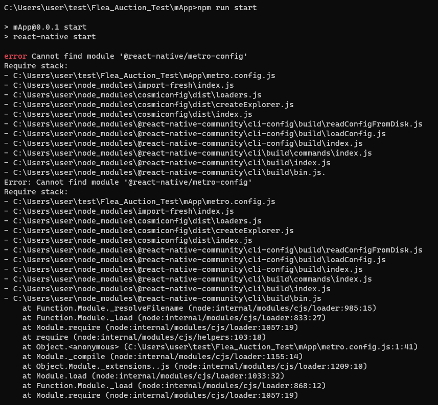
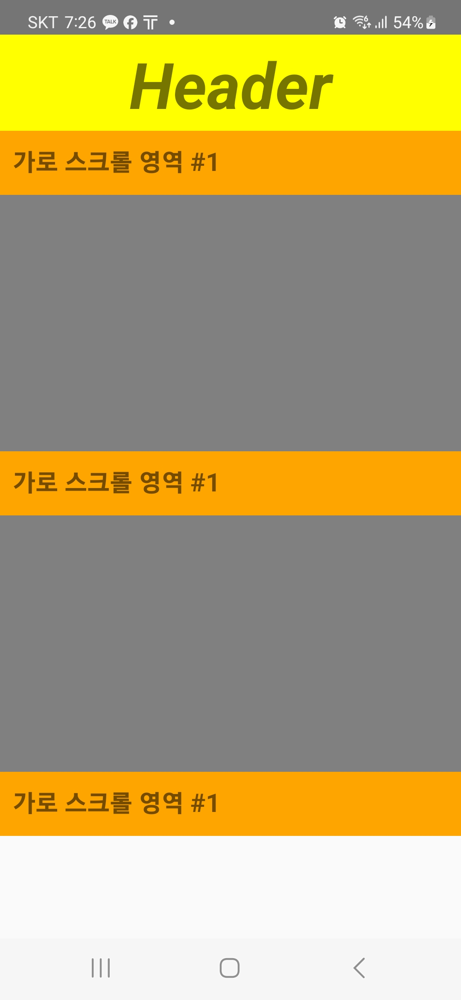

# Troblueshooting
- 다음은 실행 시 이슈적인 부분을 추가합니다.

## 소스코드 받은 이후, 실행이 되지 않는 경우
(1) git clone https://github.com/BerkleyLim/Flea_Auction_Test 이후,
아래와 같은 이슈가 발생할 경우


<br/><br/>

<h4>Solution</h4>

```
$ npm install # 이 명령어로 라이브러리 설치
```

(2) 아래와 같이 화면이 뜨는 경우
- 이 경우 다시 제거하고 다시 빌드하기
- 아래와 같은 화면은 개발할 당시 만든 UI이고, SSE 연동 전 파일 중 하나이다.
- 만일 아래와 같은 화면이 표시가 된다면 에러가 맞음




